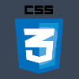

# Howzit

My name is just to the left of this panel, under the trumpeting cat, as you have probably seen. I'm a former Architectural Technologist from Cape Town, South Africa. After moving to Berlin in February of 2020 (Yeah, perfect timing, right!) I decided to migrate my skills to the tech industry. So here I am...

**Welcome to my GitHub.**

## Tools of the trade.

### What I use.

)

  

### Where I learned them.

## How I use them.

